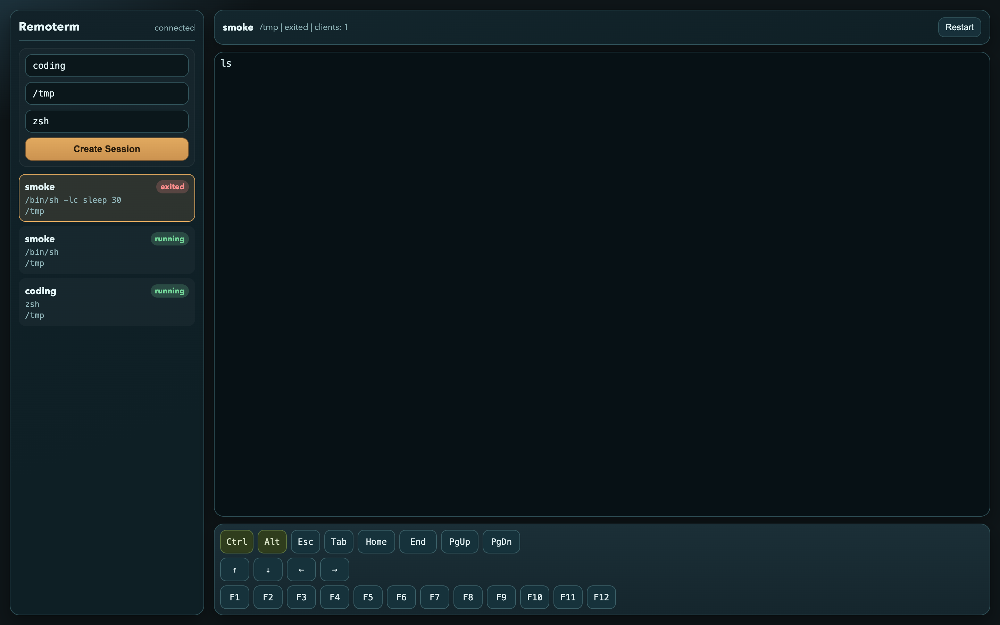
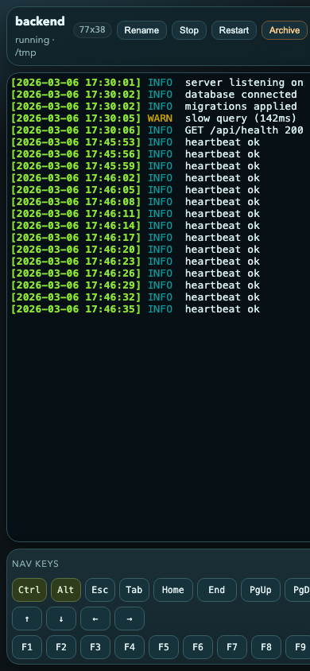

# Remoterm

Persistent, multi-session remote terminal server. A `ttyd` alternative built in Rust for long-running coding agent workflows.





## Features

- **Multiple named sessions** — run `backend`, `monitoring`, `frontend` side by side, switch from a sidebar
- **Survives everything** — close your laptop, reattach from your phone, even restart the server — sessions keep running
- **Works on mobile** — full soft keyboard with Ctrl, Alt, Esc, arrows, function keys — usable from a phone
- **Focus mode** — hide the sidebar and chrome for a distraction-free terminal
- **Single binary** — no dependencies, no config files, just run it. SQLite for persistence, web UI built in

## Install

Download a prebuilt binary from the [latest release](https://github.com/mr-karan/remoterm/releases/latest), or use Docker:

```bash
docker pull ghcr.io/mr-karan/remoterm:latest
```

Or build from source:

```bash
cargo build --release -p remoterm-server
```

## Quick start

```bash
remoterm-server --listen 127.0.0.1:8787
```

Then open http://127.0.0.1:8787/

Or with Docker Compose:

```bash
docker compose up -d
```

## API

| Method | Endpoint | Description |
|--------|----------|-------------|
| `GET` | `/healthz` | Health check |
| `GET` | `/api/sessions` | List all sessions |
| `POST` | `/api/sessions` | Create session (`{"name","cwd","shell","args"}`) |
| `GET` | `/api/sessions/:id` | Get session |
| `PATCH` | `/api/sessions/:id` | Rename session |
| `DELETE` | `/api/sessions/:id` | Delete session |
| `POST` | `/api/sessions/:id/restart` | Restart session |
| `POST` | `/api/sessions/:id/stop` | Stop session |
| `POST` | `/api/sessions/:id/archive` | Archive session |
| `POST` | `/api/sessions/:id/restore` | Restore archived session |
| `GET` | `/ws/:id` | WebSocket attach (PTY + replay) |

## Deployment

See [docs/deployment.md](docs/deployment.md) for native host, Docker, systemd, and reverse proxy setup.

## Architecture

- **`remoterm-server`** — Axum HTTP/WS server, PTY management, SQLite storage
- **`remoterm-proto`** — Shared protocol types (frames, session models)
- **`static/index.html`** — Built-in web UI (embedded via `include_str!`)

## Protocol

WebSocket at `/ws/:session_id` with JSON framing:

- Client sends `hello` with `resume_from_seq` for reconnect replay
- Server replies with `hello_ack` + `snapshot` (buffered output) + `status`
- Live `output` frames with monotonic `seq`
- Client sends `input`, `resize`, `keyboard` actions

## Development

```bash
# Dev server with debug logging
just dev

# Run all tests (unit + restart recovery integration)
just test

# Interactive smoke test
just smoke
```

## Security

No built-in auth yet. Bind to localhost or put behind Tailscale / VPN / reverse proxy with auth. Do not expose to the public internet without authentication.

## License

MIT
